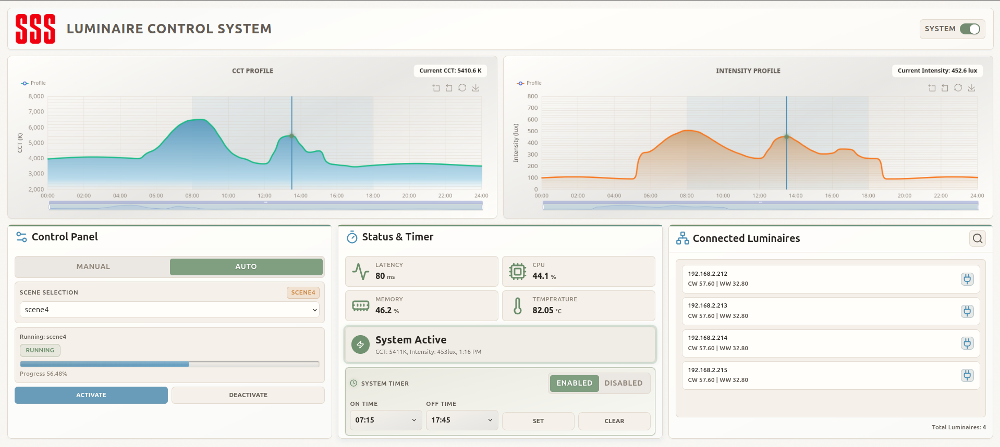

# Luminaire Control System

## Dashboard


A local lighting control platform that coordinates luminaires, scheduling, timers, and system state through Redis pub/sub, with a web dashboard for monitoring and control. The UI consumes live updates via SSE from an event gateway that aggregates Redis events into a unified snapshot.

**Services (compose names)**
- `redis`
- `luminaire-service`
- `state-service`
- `scheduler-service`
- `timer-service`
- `metrics-service`
- `event-gateway`
- `webapp`

**Prereqs**
- Docker
- Docker Compose

**Deploy Compose**
- `deploy/compose.yaml`
- Usage:
```bash
docker compose -f deploy/compose.yaml up
```

See `deploy/README.md` for env var reference.
See `docs/ARCHITECTURE.md` to learn about the project architecture.